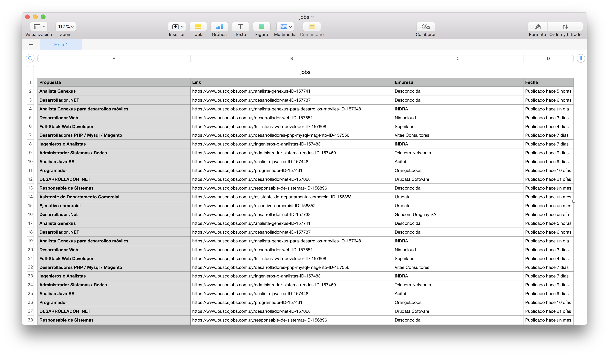

# Laburar 💪

Ve todos los trabajos informáticos de buscojobs y computrabajo sin tener que hacer scroll todos los días  😎




## Instalación

```bash
git clone "https://github.com/nsantos16/laburar"
cd laburar
python execute.py #genera csv en la carpeta
```

## Dependencias

 - Python 2.7
```bash
pip install urllib2
pip install beautifulsoup
```

